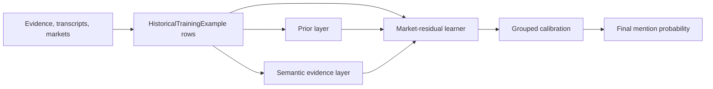

# Mention Engine Architecture

## 1) Goal

The mention engine estimates the probability that a Kalshi earnings-mention contract resolves YES:

- `1`: the target phrase appears in eligible company-side earnings-call speech.
- `0`: the target phrase does not appear under the settlement-style label rules.

The primary metric is out-of-sample Brier score on realistic event-grouped splits. The trading objective is not just a low standalone error rate; it is calibrated probability edge versus Kalshi prices, with enough provenance to trust why a forecast moved away from the market.

## 2) Current Architecture

The current stack is a four-layer probability system:

1. Prior layer
2. Semantic evidence layer
3. Market-residual learner
4. Grouped calibration layer

The older `model1` logistic stack remains available, but the newer architecture is designed around market anchoring and residual learning.



## 3) Data Model

Training and benchmark rows are represented as `HistoricalTrainingExample` in `src/kalorie/ml/datasets.py`.

Each row includes:

- company/event identity,
- target phrase,
- binary settlement label,
- pre-call evidence feature dictionary,
- document provenance,
- `market_probability`,
- market venue and event ticker metadata.

The feature dictionary is intentionally open-ended. Both `model1` and the market-residual stack discover feature columns from example rows.

## 4) Evidence And Labels

Evidence and labels are deliberately separated:

- Evidence features come from pre-call documents: SEC/EX-99, press releases, news, and other time-valid manifests.
- Transcript text is used for labels and prior-call recurrence, not as same-event predictive evidence.
- Current-event labels use company-side transcript matching via `label_document_chunks(..., entity_scope="company_employee")`.

Timing control is centralized around the decision cutoff. Time-sensitive documents obey `call_start - 10 minutes`; event-baseline documents such as earnings releases can be retained under explicit event-baseline semantics.

Key files:

- `src/kalorie/ml/datasets.py`
- `src/kalorie/ml/real_training_data.py`
- `src/kalorie/ml/labeling.py`
- `src/kalorie/io/transcript_corpus.py`

## 5) Prior Layer

The prior layer gives the model sane probabilities before evidence similarity is considered.

Implemented prior features include:

- market prior features: `market_probability`, `market_logit`,
- phrase category one-hots,
- target global historical rates,
- company-target rates,
- company-category rates,
- company global rates,
- category global rates,
- prior-call recurrence features.

Phrase categories are defined in `src/kalorie/ml/priors.py`:

- `alias`
- `macro`
- `competitor`
- `codename_or_product`
- `multiword`
- `generic`

Prior-call recurrence is computed only from strictly prior same-company transcripts. It includes:

- `prior_call_count`
- `prior_mention_count`
- `prior_mention_rate`
- `prior_recent_mention_binary`
- `prior_mention_streak`

Key files:

- `src/kalorie/ml/priors.py`
- `src/kalorie/ml/features.py`
- `src/kalorie/io/transcript_corpus.py`
- `src/kalorie/ml/real_training_data.py`

## 6) Semantic Evidence Layer

The semantic evidence layer answers: "Does the pre-call information set support this phrase, alias, topic, or likely Q&A discussion?"

Implemented evidence channels include:

- exact and settlement-style phrase counts,
- lexical alias matches,
- TF-IDF phrase-to-evidence similarity,
- alias-expanded TF-IDF similarity,
- hard-negative neighbor features,
- template phrase embedding similarity,
- event scenario embedding similarity,
- alias-expanded embedding retrieval features,
- evidence source reliability features,
- news document ratio.

Aliases are predictive evidence only; they do not alter settlement truth. Settlement labels still depend on the canonical normalized target phrase.

Alias support includes:

- `TargetPhrase.aliases`,
- `src/kalorie/ml/aliases.py` for manifest loading and alias merging,
- alias lexical/TF-IDF features,
- alias embedding retrieval features.

Key files:

- `src/kalorie/ml/features.py`
- `src/kalorie/ml/aliases.py`
- `src/kalorie/ml/embeddings.py`
- `src/kalorie/data_grepping/template_phrases.py`
- `src/kalorie/data_grepping/event_scenarios.py`

## 7) Market-Residual Learner

The full architecture now includes a market-anchored residual learner in `src/kalorie/ml/market_residual.py`.

Instead of predicting the event probability directly from evidence alone, this model learns how to move away from the market:

```text
final_logit = market_logit + residual_logit(features)
probability = sigmoid(final_logit)
```

The residual learner currently uses `GradientBoostingRegressor` from scikit-learn. It trains on residual logits:

```text
target_residual = logit(label_smoothed) - logit(market_probability)
```

This gives the model a clearer job: learn where evidence, priors, aliases, phrase type, and recurrence imply the market is too high or too low.

Market microstructure features include:

- `market_mid_probability`
- `market_spread`
- `market_wide_spread_binary`
- `market_illiquidity_score`

The benchmark runner can now evaluate residual artifacts with the same row/report shape as `model1` through `run_market_residual_pack_benchmark()`.

Key files:

- `src/kalorie/ml/market_residual.py`
- `src/kalorie/benchmarking/runner.py`
- `tests/unit/test_market_residual.py`
- `tests/unit/test_benchmark_runner.py`

## 8) Grouped Calibration

Grouped calibration lives in `src/kalorie/ml/grouped_calibration.py`.

It calibrates by:

- phrase category,
- evidence-strength bucket.

Evidence buckets are rule-based:

- `strong`: exact match, alias match, or strong alias embedding support,
- `medium`: meaningful semantic/TF-IDF/embedding support,
- `weak`: little direct evidence support.

The grouped calibrator fits temperature values by group and shrinks small groups back toward a global fallback temperature. This avoids overreacting to tiny buckets while still allowing macro, generic, codename, and alias markets to calibrate differently.

The residual model applies grouped calibration automatically and records `grouped_calibration` in prediction reasons.

Key files:

- `src/kalorie/ml/grouped_calibration.py`
- `src/kalorie/ml/market_residual.py`
- `tests/unit/test_grouped_calibration.py`

## 9) Legacy `model1`

`model1` remains available in `src/kalorie/ml/model1.py`.

It now supports:

- global logistic regression,
- company-specific overrides,
- phrase-category overrides,
- hierarchical priors,
- optional market-prior features,
- optional temperature/isotonic calibration,
- optional target indicators for legacy experiments.

`model1` is still useful for transparent ablations and fallback scoring. The market-residual stack is the preferred architecture for experiments that use real market prices.

## 10) Benchmarking And Evaluation

Benchmark packs are defined in `src/kalorie/benchmarking/packs.py` and evaluated in `src/kalorie/benchmarking/runner.py`.

The runner supports:

- `run_model1_pack_benchmark()`
- `run_market_residual_pack_benchmark()`

Reports include:

- Brier score,
- expected calibration error,
- Kalshi bid/ask/mid comparisons,
- per-event metrics,
- row-level probabilities and prediction reasons.

Recent quick residual smoke testing used existing artifacts only. Results were mixed because the current available training set is still thin and partly synthetic:

| Evaluation Set | Kalshi Mid Brier | Legacy Model1 Brier | Residual Brier |
| --- | ---: | ---: | ---: |
| 5-event pack | `0.197245` | `0.220804` | `0.198814` |
| TGT/LOW fresh | `0.262412` | `0.242701` | `0.401064` |
| NVDA fresh | `0.272109` | `0.463446` | `0.147606` |
| CAVA fresh | `0.250000` | `0.188821` | `0.001771` |

Interpretation: the architecture is wired and testable, but current performance should not be treated as stable until more real event rows are added.

## 11) Verification Status

After the full architecture pass:

- Unit tests: `204 passed`
- Focused architecture tests: `42 passed`
- Residual/calibration/benchmark tests: `7 passed`
- Ruff on changed architecture files: `All checks passed`
- IDE lints on changed files: no errors

## 12) Current Limitations

The main limitations are data and integration depth, not just model code:

- The residual model needs more real Kalshi event rows with reliable T-minus decision-time prices.
- Some existing fresh-validation example files store extreme ask/placeholder market probabilities; benchmark reports with Kalshi mid are more reliable for comparisons.
- News coverage is still uneven across historical rows.
- Alias enrichment exists, but large-scale LLM/web alias manifests are not yet populated.
- The residual model is currently an in-process Python artifact; persistence/loading conventions should be formalized before production use.
- CLI commands still primarily expose `model1`; residual training/evaluation is available through Python APIs and benchmark runner functions.

## 13) Next Work

High-priority next steps:

1. Build more real, event-grouped Kalshi training rows with exact decision-time mid prices.
2. Add a first-class CLI command for training/evaluating `market_residual`.
3. Persist residual artifacts safely despite the embedded sklearn estimator.
4. Generate alias manifests for codename/product markets.
5. Add spread/depth from real orderbooks when available, not just bid/ask spread.
6. Re-run blind packs after the current data pull completes.

The architecture is now in place for the intended modeling direction: market anchored, evidence aware, category calibrated, and ready for larger semantic inputs.
