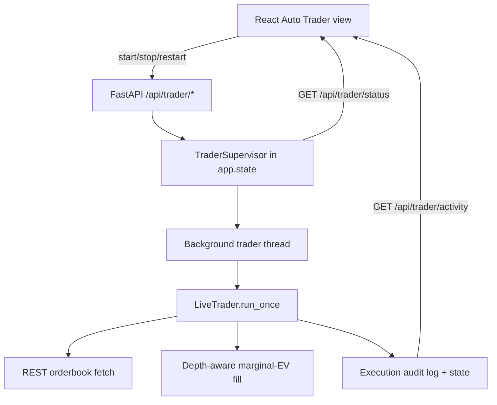

# Auto-Trader Phase 2: In-App Control, Depth-Aware Execution

> Builds on the live-trading safeguards (execution package). Goal: control the
> autonomous trader from the web UI in the same backend process, make its trades
> visible, and make order sizing/execution robust to real orderbook liquidity.

## Goals

1. Run the trader as a background worker inside the FastAPI backend, started/stopped/restarted from the UI. No trading from request handlers.
2. Staged (UI) vs running (bot) config: changing the model/preset in the UI does not affect the running bot until "Restart with changes".
3. Make trades/decisions visible: an Auto Trader view with status, controls, and a live activity feed.
4. Depth-aware, fee-aware, marginal-EV order sizing against a fresh orderbook.
5. Model-staleness tiers so we act on the existing model snapshot without re-running the model on every book change.
6. Partial-fill reconciliation and the other edge cases enumerated below.

## Architecture

- `TraderSupervisor` owns exactly one worker thread; singleton in `app.state`.
- Execution loop is fast (default 15s). Model re-eval stays on the poller (~10 min); the trader never calls the model/OpenAI.
- Trading happens only in the worker loop; request handlers only read state or signal the supervisor.

## Decisions (confirmed)

- Process model: in-process background worker thread in the FastAPI backend. CLI remains for headless/testing.
- Depth source: fetch the full orderbook via REST immediately before each order.

## Depth-Aware, Fee-Aware Marginal-EV Fill

- Model fair prob `p` for the chosen side. Edge buying at price `c` = `p - c - fee(c)`.
- Fee model (configurable): `fee_per_contract(c) = fee_rate * c * (1 - c)`, default `fee_rate = 0.07`; order-level fee rounds up to the cent.
- Walk ask ladder ascending; accept each marginal contract while `edge >= min_margin` AND cumulative `<= recommended_contracts` AND exposure/cash caps hold.
- Submit one limit buy at the worst accepted price; cap `count` to depth available at-or-better than that price so nothing material rests.
- Result handles thin liquidity (fill less) and deep liquidity (reach target size cheaply, never exceeding `recommended_contracts`).

## Model-Staleness Tiers (no model re-run)

Compare live top-of-book mid to the snapshot mid the model was scored against:

- Within `epsilon_exec` (default 0.03): model valid -> execute with depth-aware fill.
- Between `epsilon_exec` and `epsilon_halt`: skip this round, wait for next scheduled re-eval. No durable halt.
- Beyond `epsilon_halt` (default 0.10): durable halt + cancel resting orders.
- Depth-anomaly guard: if executable depth at the acceptable price is far above the recent norm even without a big price move, skip until next re-eval.

## Edge Cases To Cover

- Partial fills: reconcile actual fills (positions/fills), cancel remainder, record filled count/price (not intent) into counters/exposure.
- Exchange rejects (balance, closed market, off-tick, size limits): fail closed, audit, no blind retry.
- Market status: confirm `open` in the fresh fetch before submit.
- Fees subtracted from EV at the margin.
- Stale/disconnected data: stamp freshness; no trade on stale book or failed fetch.
- Crash between submit and state-write: deterministic client_order_id + reconcile-on-startup.
- Restart safety: halts, dedupe ids, daily counters, loss-stop survive restart; no re-fire.
- UTC day rollover for daily caps/loss-stop.
- Cash/exposure race within one pass: running drawdown already modeled.
- Stacking/opposing positions: enforce per-contract max_position; decide add-to-position policy (default: do not add beyond cap).
- New/unscored market: skip.
- Localhost-only control endpoints.

## Tasks

1. Orderbook depth model + REST fetch in execution client (`get_orderbook`), with ladder parsing. TDD.
2. Fee model + depth-aware marginal-EV fill engine (`execution/sizing.py`, pure). TDD.
3. Staleness tiers + depth-anomaly guard in config/safeguards. TDD.
4. Trader integration: fresh orderbook -> fill engine -> staleness gate -> submit; partial-fill reconciliation. TDD.
5. `TraderSupervisor` (thread lifecycle, staged-vs-running snapshot, status). TDD.
6. FastAPI `/api/trader/*` endpoints wired to supervisor; live-mode confirmation; localhost-only. TDD with TestClient.
7. React Auto Trader view: status bar, start/stop/restart-with-changes, activity feed, positions/orders. `npm run build`.
8. Verification sweep + todo.md review entry.

## Verification

- `python -m pytest -q` and `python -m ruff check src tests` after each backend task.
- `npm run build` in `web` for the UI task.
- Dry-run smoke through the supervisor proving zero live POSTs outside live mode.

## Review (completed)

All 8 tasks landed with TDD. Final state:

- Backend: 241 tests pass, ruff clean. New modules: `execution/sizing.py` (fee-aware
  marginal-EV fill), `execution/supervisor.py` (threaded lifecycle, staged-vs-running
  snapshot). `execution/client.py` gained `OrderbookDepth` + `get_orderbook`.
  `safeguards.evaluate_signal` is now a pure gate (sizing moved to the fill engine) with
  3-tier staleness (`execution_drift_tolerance` / skip / `price_swing_threshold`).
  `LiveTrader` fetches a fresh REST orderbook, runs the depth-anomaly guard, sizes via the
  fill engine, clears stale resting orders before re-submitting, and audits every path.
- API: `/api/trader/status|start|stop|restart|activity|kill|resume` wired to a
  `TraderSupervisor` in `app.state`; bound to 127.0.0.1; trading only in the worker loop.
- Frontend: `AutoTraderPage` (status bar, Start/Stop/Restart-with-changes, emergency stop,
  activity feed, positions) + `useTrader` hook (5s polling) + a header trader badge.
  `npm run build` is clean.
- Offline dry-run smoke: `preview` produced `8 NO @<= 0.58 (blended 0.580, EV 0.74)` with
  zero submissions, exercising the full depth-aware path.

### Known follow-ups (not yet done)

- Running model_name is recorded/displayed but the worker's signal source is the latest
  poll cache; aligning the running model with a per-model signal source is a follow-up.
- Partial-fill reconciliation is conservative (cancel stale remainder each loop + count
  intended exposure). Exact filled-quantity accounting needs a fills/get-order endpoint.
- `start-stack.ps1 -LiveTrader` still launches the standalone CLI loop; the in-process
  supervisor is now the primary path. Avoid running both against the same execution root.
